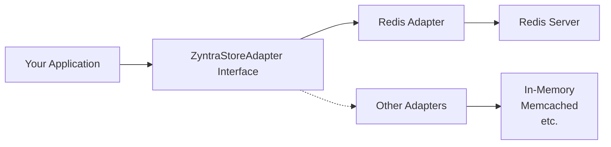

## Overview

The Store adapter provides a powerful, type-safe interface for caching and Pub/Sub messaging in ZyntraJS applications. Built on Redis, it enables high-performance data storage, retrieval, and real-time event broadcasting across your application.

<Callout type="info">
  The Store adapter enables both caching capabilities and real-time features via Pub/Sub messaging. Adding a store adapter also automatically enables the `.realtime` service for building real-time applications.
</Callout>

### Key Features

- **Key-Value Caching**: Store and retrieve data with automatic JSON serialization
- **TTL Support**: Set expiration times on cached values to keep data fresh
- **Pub/Sub Messaging**: Publish and subscribe to channels for event-driven communication
- **Atomic Operations**: Increment counters and manage key expiration atomically
- **Type Safety**: Full TypeScript inference from store operations to cached values
- **Adapter Architecture**: Works with any Redis-compatible backend via the adapter pattern

---

## Architecture

The Store system follows ZyntraJS's adapter pattern, providing a unified interface (`ZyntraStoreAdapter`) that can be implemented by different storage backends. The Redis adapter (`@zyntra-js/adapter-redis`) is the production-ready implementation.



The adapter handles:
- **Serialization**: Automatic JSON stringify/parse for complex objects
- **Client Management**: Separate clients for commands and subscriptions (Redis requirement)
- **Error Handling**: Graceful fallbacks and error recovery

---

## Quick Start

### 1. Install Dependencies

<Tabs items={['npm', 'pnpm', 'yarn', 'bun']} groupId="package-manager">
  <Tab value="npm">
    ```bash
    npm install @zyntra-js/adapter-redis ioredis
    ```
  </Tab>
  <Tab value="pnpm">
    ```bash
    pnpm add @zyntra-js/adapter-redis ioredis
    ```
  </Tab>
  <Tab value="yarn">
    ```bash
    yarn add @zyntra-js/adapter-redis ioredis
    ```
  </Tab>
  <Tab value="bun">
    ```bash
    bun add @zyntra-js/adapter-redis ioredis
    ```
  </Tab>
</Tabs>

### 2. Create the Adapter

```typescript
// src/services/store.ts
import { createRedisStoreAdapter } from '@zyntra-js/adapter-redis';
import { Redis } from 'ioredis';

const redis = new Redis(process.env.REDIS_URL);

export const store = createRedisStoreAdapter(redis);
```

### 3. Register with Zyntra

```typescript
// src/zyntra.ts
import { Zyntra } from '@zyntra-js/core';
import { store } from './services/store';

export const zyntra = Zyntra
  .context<AppContext>()
  .store(store)
  .create();
```

### 4. Use in Your Actions

```typescript
export const usersController = zyntra.controller({
  path: '/users',
  actions: {
    list: zyntra.query({
      handler: async ({ context, response }) => {
        // Check cache first
        const cached = await context.store.get<User[]>('users:list');
        
        if (cached) {
          return response.success({ users: cached, source: 'cache' });
        }
        
        // Fetch from database
        const users = await context.db.users.findMany();
        
        // Cache for 5 minutes
        await context.store.set('users:list', users, { ttl: 300 });
        
        return response.success({ users, source: 'database' });
      },
    }),
  },
});
```

---

## Core Concepts

### Caching

Use the store for high-performance caching of expensive operations:

- **`get<T>(key)`**: Retrieve cached values with automatic deserialization
- **`set(key, value, options?)`**: Store values with optional TTL
- **`delete(key)`**: Remove cached entries
- **`has(key)`**: Check if a key exists without retrieving its value

### Pub/Sub Messaging

Enable event-driven communication between services:

- **`publish(channel, message)`**: Broadcast messages to subscribers
- **`subscribe(channel, callback)`**: Listen for messages on a channel
- **`unsubscribe(channel, callback?)`**: Stop listening to channels

### Atomic Operations

Perform atomic operations on numeric values:

- **`increment(key)`**: Atomically increment a counter
- **`expire(key, ttl)`**: Set or update a key's expiration time

---

## Use Cases

### API Response Caching

Cache expensive database queries or external API calls:

```typescript
const cached = await context.store.get<ApiResponse>('api:data');
if (cached) return cached;

const data = await fetchExpensiveData();
await context.store.set('api:data', data, { ttl: 3600 });
return data;
```

### Session Management

Store user sessions with automatic expiration:

```typescript
await context.store.set(`session:${userId}`, sessionData, { ttl: 86400 });
```

### Real-Time Notifications

Broadcast events across your application:

```typescript
// Publisher
await context.store.publish('notifications', {
  userId: '123',
  message: 'You have a new message',
});

// Subscriber
await context.store.subscribe('notifications', async (message) => {
  console.log('Notification received:', message);
});
```

### Rate Limiting

Use atomic increments for rate limiting:

```typescript
const count = await context.store.increment(`rate:${userId}`);
if (count === 1) {
  await context.store.expire(`rate:${userId}`, 60);
}
if (count > 100) {
  throw new Error('Rate limit exceeded');
}
```

---

## Next Steps

- Learn how to [install and configure](/docs/store/installation) the Redis adapter
- Explore [caching operations](/docs/store/caching) in detail
- Discover [Pub/Sub messaging](/docs/store/pubsub) patterns
- Master [atomic operations](/docs/store/atomic-operations) for counters and expiration
- Check out [advanced usage patterns](/docs/store/advanced)
- Browse the complete [API reference](/docs/store/api-reference)

